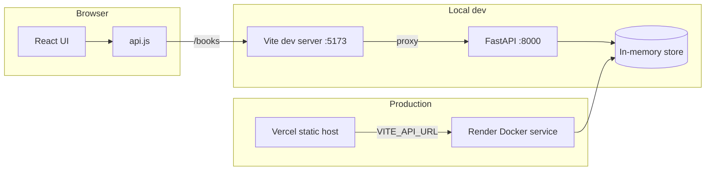

# Reading List Tracker

A full-stack demo app for tracking books through a simple reading workflow. Users can view their list, filter by status, and update a book's progress. The project was built with a multi-agent workflow (backend, frontend, testing, deployment, and QA agents working in parallel git worktrees) and integrated into a single repository.

## Tech stack

| Layer | Technology |
|-------|------------|
| **Backend API** | [FastAPI](https://fastapi.tiangolo.com/) 0.115, [Pydantic](https://docs.pydantic.dev/) 2.9, [Uvicorn](https://www.uvicorn.org/) |
| **Frontend** | [React](https://react.dev/) 18, [Vite](https://vitejs.dev/) 5 |
| **Testing** | [pytest](https://docs.pytest.org/), FastAPI `TestClient`, httpx |
| **Backend deployment** | Docker, [Render](https://render.com/) (Blueprint) |
| **Frontend deployment** | [Vercel](https://vercel.com/) (static build) |
| **Storage** | In-memory Python dict (demo/ephemeral; data resets on restart) |

## Architecture

The app follows a classic **decoupled client–server** layout: a React SPA talks to a REST JSON API over HTTP. In local development, Vite proxies `/books` requests to the FastAPI server so the frontend can use same-origin URLs without CORS friction.



### Backend layers

```
backend/app/
├── main.py        # FastAPI app, CORS middleware, exception handlers
├── routes.py      # REST endpoints and in-memory book store
├── models.py      # Pydantic models and Status enum
└── validation.py  # Maps validation errors to HTTP 400 responses
```

- **Routes** expose CRUD-style book operations at the root path (`/books`, not `/api/books`).
- **Models** validate input (non-blank title/author, trimmed whitespace, enum status values).
- **Validation handler** converts FastAPI/Pydantic 422 errors into consistent 400 responses.
- **CORS** reads `CORS_ORIGINS` from the environment and allows Vercel preview/production origins via regex.

### Frontend layers

```
frontend/src/
├── App.jsx              # State, data loading, filtering, status updates
├── api.js               # Centralized fetch wrapper and API calls
└── components/
    ├── FilterBar.jsx    # All / To Read / Reading / Done filters
    ├── BookList.jsx     # List container
    └── BookCard.jsx     # Book row with status selector
```

- **Optimistic updates**: the UI updates immediately on status change and rolls back only the affected row if the request fails.
- **Per-row pending state**: concurrent updates to different books do not block each other.
- **Error handling**: load failures show a retry banner; row-level PATCH errors appear on the affected card.

## Features

- List all books from the API
- Filter by status: `to-do`, `reading`, `done`
- Change a book's status via dropdown (PATCH)
- Loading, empty, and error states
- Input validation on the backend (missing fields, invalid types, blank strings)
- Health check endpoint for deployment probes
- Cross-origin support for split frontend/backend hosting

## API reference

Base URL: backend root (no `/api` prefix).

| Method | Path | Description |
|--------|------|-------------|
| `GET` | `/health` | Health check → `{"status":"ok"}` |
| `GET` | `/books` | List all books |
| `GET` | `/books?status={status}` | List books filtered by status |
| `GET` | `/books/count` | Count books (optional `?status=` filter) |
| `GET` | `/books/{id}` | Get one book (404 if missing) |
| `POST` | `/books` | Create a book |
| `PATCH` | `/books/{id}` | Update book status |

### Book object

```json
{
  "id": 1,
  "title": "Dune",
  "author": "Frank Herbert",
  "status": "to-do"
}
```

### Status values

| Value | Meaning |
|-------|---------|
| `to-do` | Not started (default on create) |
| `reading` | Currently reading |
| `done` | Finished |

### Example requests

```bash
# Create
curl -X POST http://localhost:8000/books \
  -H "Content-Type: application/json" \
  -d '{"title":"Dune","author":"Frank Herbert"}'

# List
curl http://localhost:8000/books

# Update status
curl -X PATCH http://localhost:8000/books/1 \
  -H "Content-Type: application/json" \
  -d '{"status":"reading"}'
```

Interactive API docs are available at `http://localhost:8000/docs` when the backend is running.

## Project structure

```
Reading_List_Tracker/
├── backend/                 # FastAPI application and pytest suite
│   ├── app/
│   ├── tests/
│   └── requirements.txt
├── frontend/                # React + Vite SPA
│   ├── src/
│   ├── vite.config.js
│   ├── vercel.json
│   └── .env.example
├── deployment/              # Docker + Render Blueprint
│   ├── Dockerfile
│   └── render.yaml
├── .agent/                  # Multi-agent task/status metadata
├── orchestrator.py          # Prints agent completion status
└── README.md
```

## Local development

### Prerequisites

- Python 3.9+ (3.11 used in Docker)
- Node.js 18+

### Backend

```bash
cd backend
python3 -m venv .venv
source .venv/bin/activate
pip install -r requirements.txt
uvicorn app.main:app --reload --port 8000
```

Backend runs at `http://localhost:8000`.

### Frontend

```bash
cd frontend
npm install
npm run dev
```

Frontend runs at `http://localhost:5173`. Vite proxies `/books` to `http://localhost:8000` (see `frontend/vite.config.js`), so you do not need to set `VITE_API_URL` locally.

### Run both

1. Start the backend on port **8000**
2. Start the frontend on port **5173**
3. Open `http://localhost:5173` in your browser

Seed books via curl or the Swagger UI at `/docs` (the UI currently lists and updates books; it does not include a create-book form).

## Testing

```bash
cd backend
source .venv/bin/activate
pytest -v
```

The suite covers:

- Book CRUD endpoints (create, list, count, get, patch)
- Status filtering
- Validation errors (missing fields, invalid types, malformed JSON, blank strings)
- Whitespace trimming on create
- CORS headers for allowed origins
- Health check

Build the frontend separately:

```bash
cd frontend
npm run build
```

## Deployment

### Backend (Render)

1. Connect this repo to Render and use the Blueprint in `deployment/render.yaml`, or create a Docker web service manually:
   - **Dockerfile path:** `deployment/Dockerfile`
   - **Build context:** repository root
2. Render sets `$PORT` automatically; the container runs Uvicorn on that port.
3. Set the **`CORS_ORIGINS`** environment variable to your frontend URL(s), comma-separated, e.g. `https://your-app.vercel.app`.
4. Health check path: `/health`

Build the image locally (optional):

```bash
docker build -f deployment/Dockerfile -t reading-list-backend .
```

### Frontend (Vercel)

1. Import the repo into Vercel with **Root Directory** set to `frontend`.
2. Set the environment variable:
   ```
   VITE_API_URL=https://your-backend.onrender.com
   ```
   Use the bare backend origin with no trailing slash and no `/api` prefix.
3. Deploy. Vercel serves the Vite build from `dist/`.

After both are live, confirm the backend allows your frontend origin (via `CORS_ORIGINS` or the built-in `*.vercel.app` regex) and that `VITE_API_URL` points at the correct Render URL.

## Environment variables

| Variable | Where | Description |
|----------|-------|-------------|
| `CORS_ORIGINS` | Backend (Render) | Comma-separated allowed browser origins |
| `VITE_API_URL` | Frontend (Vercel / `.env`) | Backend base URL in production; leave empty for local dev proxy |
| `PORT` | Backend (Render) | Injected by Render; Uvicorn binds to this port |

See `frontend/.env.example` for local frontend configuration.

## Design notes and limitations

- **Ephemeral storage:** books live in an in-memory dict. Restarts, redeploys, and idle spin-down on free tiers wipe data. Suitable for demos; add a database for persistence if needed.
- **No authentication:** all endpoints are public. Acceptable for a single-user demo.
- **Single-process IDs:** book IDs are generated with `itertools.count()` and are not shared across workers or restarts.

## License

See [LICENSE](LICENSE).
